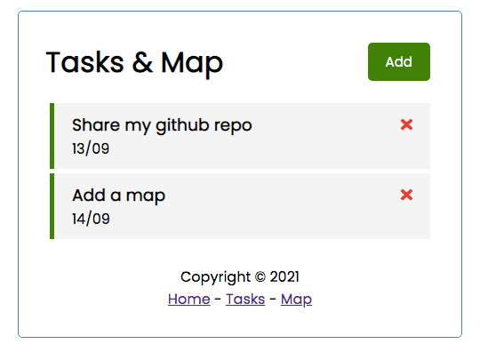
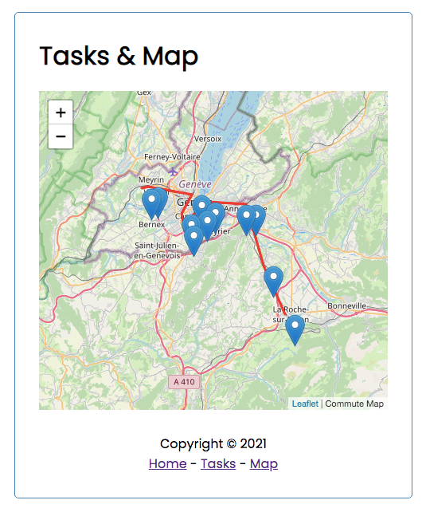

# Task and Map

A fork based on the Angular Crash Course 2021 (see below).

## Tasks module
This component was already existing within the Crash Course



## Map module
This component has been added with Leaflet



# Angular Crash Course 2021 (Task Tracker App)

This is the project from the [YouTube crash course](https://www.youtube.com/watch?v=3dHNOWTI7H8). It includes the Angular ui as well as JSON-server for our mock backend

Source: https://github.com/bradtraversy/angular-crash-2021.git

## Usage

### Install dependencies

```
npm install
```

### Run Angular server (http://localhost:4200)

```
ng serve
```

### Run the JSON server (http://localhost:5000)

```
npm run server
```

### To build for production

```
ng build
```

### Additional notes

```
nvm --version
node -v
npm -v
ng version


nvm ls
nvm ls-remote
nvm ls available
nvm install 8.1.0
nvm use 4.2

node -v
v7.2.1
nvm use v14.17.5
Now using node v14.17.5 (npm v6.14.14)
npm install -g @angular/cli
```
